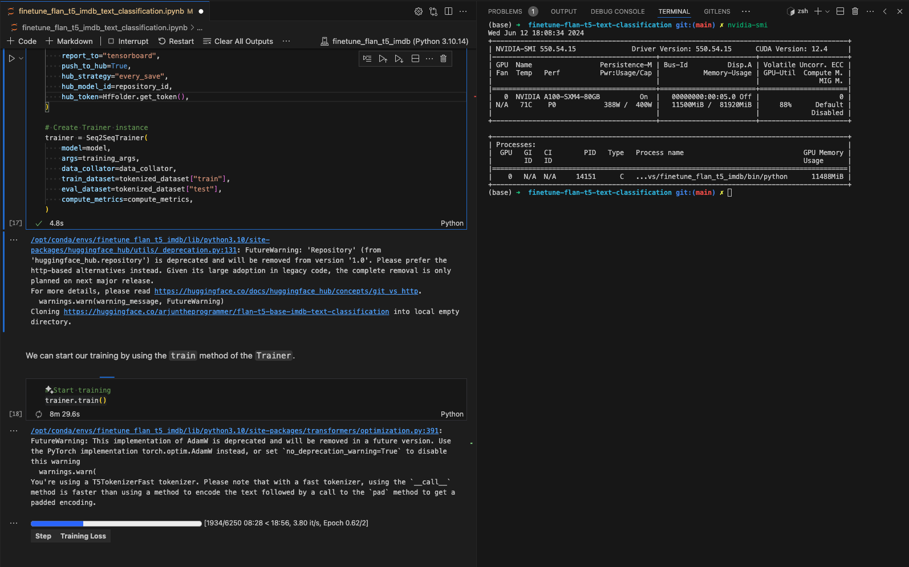

# FLAN-T5-BASE IMDB TEXT-CLASSIFICATION

This model is a fine-tuned version of [google/flan-t5-base](https://huggingface.co/google/flan-t5-base) on the [IMDB](https://huggingface.co/datasets/imdb) dataset.


## Model description

In this implementation, using the **Flan T5 large language model**, we performed the Text Classification task on the IMDB dataset and obtained a very good **accuracy of 93%**.


## Training and evaluation data

This model was trained on the imdb train dataset with 25,000 data and then tested and evaluated on the imdb test dataset with 25,000 data.

It achieves the following results on the evaluation set:

- Loss: 0.0786
- F1: 94.9518
- Gen Len: 2.4939


Output

```cmd
               precision    recall  f1-score   support

           0       0.97      0.72      0.83     12500
           1       0.78      0.98      0.87     12500

    accuracy                           0.85     25000
   macro avg       0.87      0.85      0.85     25000
weighted avg       0.87      0.85      0.85     25000

```

---

## Training procedure

### TRAINING LOGS

Training Time: 26 minutes

GPU Memory: 11500 MiB



### Training hyperparameters

The following hyperparameters were used during training:

- learning_rate: 0.0003
- train_batch_size: 8
- eval_batch_size: 8
- seed: 42
- optimizer: Adam with betas=(0.9,0.999) and epsilon=1e-08
- lr_scheduler_type: linear
- num_epochs: 2

### Training results

| Training Loss | Epoch | Step |
|:-------------:|:-----:|:----:|
| 0.099900      | 1.0   | 3125 |
| 0.044300      | 2.0   | 6250 |


### Framework versions

- Transformers 4.28.1
- Pytorch 2.0.0+cu118
- Datasets 2.12.0
- Tokenizers 0.13.3

---

### UPLOADED FINETUNED MODEL ON HF

<https://huggingface.co/arjuntheprogrammer/flan-t5-base-imdb-text-classification>

---

## YT RECORDING

[](https://youtu.be/Bt00OthyE4U)

---
